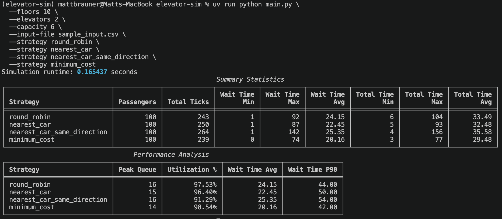

# Elevator Sim

Discrete-time elevator simulation harness for building and testing scheduling strategies.



See [`frontend/`](frontend/) for the React app used to visualize the JSON output produced by the Python simulation
script.

### Assumptions / Simplifiactions / Tradeoffs

- Simulation is tick based; elevators move at most 1 floor per tick; stopping, loading, and unloading require 1 tick each

### What Could Be Improved

- Make simulation time based and simulate elevator speed, acceleration, and deceleration; simulate passenger loading and unloading times more realistically
- Allow for testing of different elevator configurations, number of elevators, capacity, etc. simultaneously
- Allow for testing of multiple passenger input files simultaneously

Estimated project time: <!-- project-time:start -->10h 50m<!-- project-time:end -->

&copy; Copyright 2026 Matt Brauner

## Setup

```bash
uv sync
git config core.hooksPath .githooks  # for black formatting and project time pre-commit hooks
```

## Run Tests

```bash
uv run pytest
```

The test command prints coverage and fails if total coverage drops below 80%.

## Run A Strategy

Run one strategy by passing its module name under `elevator_sim.strategies`:

```bash
uv run python main.py \
  --floors 10 \
  --elevators 2 \
  --capacity 6 \
  --input-file ./sample_data/sample_input.csv \
  --strategy nearest_car_same_direction
```
The simulator reads passengers from a CSV file with this exact header:
`time,id,source,dest`. Passenger IDs may be positive integers or labels ending in digits, such as `passenger1`.

Completed strategy runs also write JSON logs to the current directory by default. Each log stores
static elevator and passenger metadata once, plus per-tick animation frames. Use `--output-dir` to choose a different
output directory.

## Compare Strategies

Pass multiple `--strategy` values to compare strategies against the same input workload:

```bash
uv run python main.py \
  --floors 10 \
  --elevators 2 \
  --capacity 6 \
  --input-file ./sample_data/sample_input.csv \
  --strategy round_robin \
  --strategy nearest_car \
  --strategy nearest_car_same_direction \
  --strategy minimum_cost
```

Each strategy produces a `log.json` file with results.

## Implement A Strategy

Create a class that inherits from `ElevatorStrategy` and returns `ElevatorDecision` objects from `plan()`.
Place each strategy in its own module under `elevator_sim/strategies`; the CLI discovers the strategy class from that
module name.
Strategies receive immutable snapshots; the simulation engine enforces capacity, floor bounds, one-floor-per-tick
movement, stop timing, loading timing, and unloading timing.

```python
from elevator_sim.core.models import SimulationSnapshot
from elevator_sim.strategies.base import ElevatorDecision, ElevatorStrategy


class MyStrategy(ElevatorStrategy):
    def plan(self, state: SimulationSnapshot) -> list[ElevatorDecision]:
        return [
            ElevatorDecision(
                elevator_id=state.elevators[0].id,
                stop_floors=(),
                assigned_passenger_ids=(),
            )
        ]
```
