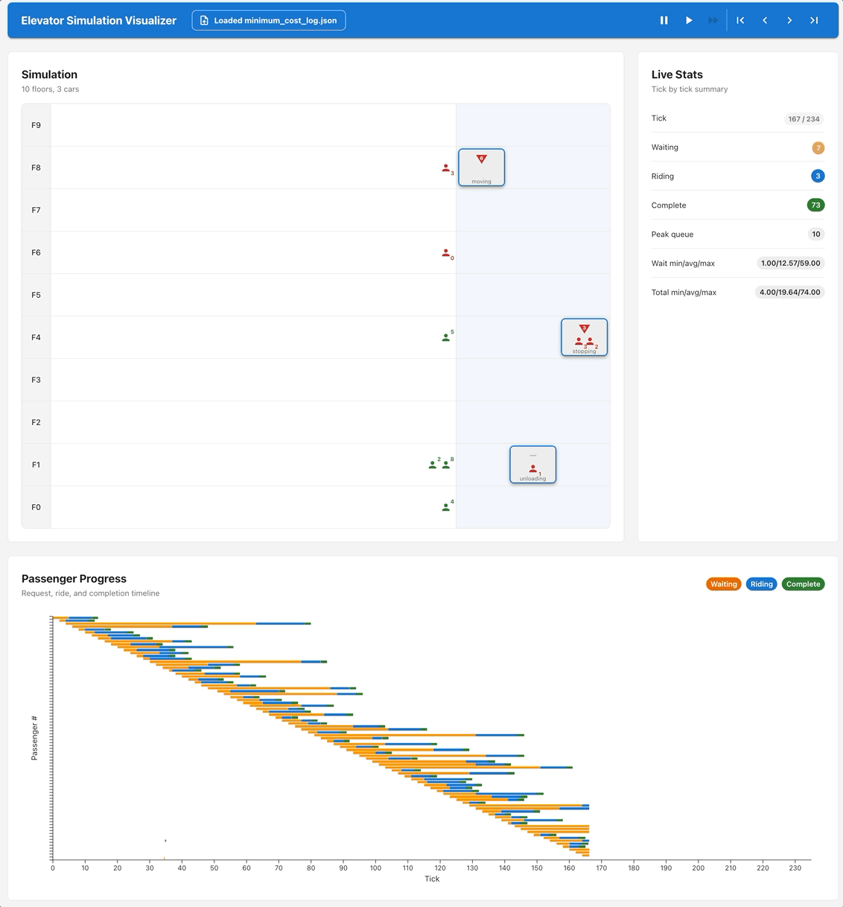

# Elevator Simulation Visualizer

React app for visualizing elevator simulation JSON logs produced by the Python script in this repository. The app runs
entirely in the browser: load a generated `.json` log, then inspect elevator positions, passenger state, playback
progress, and derived wait/ride statistics.



## Prerequisites

- Node.js
- Yarn 1.x

This project is configured with `packageManager: yarn@1.22.19`.

## Setup

Install frontend dependencies from this directory:

```bash
cd frontend
yarn install
```

## Run Tests

Run the Vitest suite once:

```bash
yarn test
```

Run tests in watch mode:

```bash
yarn test:watch
```

## Run The App

Start the Vite development server:

```bash
yarn dev
```

Open the printed local URL in a browser, then use **Load log.json** to select a simulation output file. Generate one
from the repository root with a command like:

```bash
uv run python main.py \
  --floors 10 \
  --elevators 2 \
  --capacity 6 \
  --input-file sample_input.csv \
  --strategy nearest_car_same_direction
```

By default, the Python script writes the visualization log to the current directory. Use `--output-dir` when you want
the log written somewhere else.

## Build And Preview

Create a production build:

```bash
yarn build
```

Preview the built app locally:

```bash
yarn preview
```
